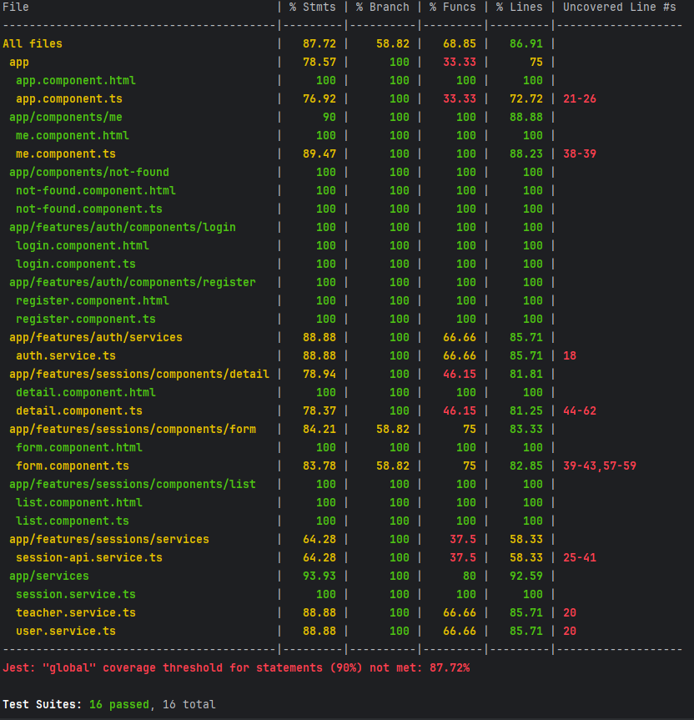
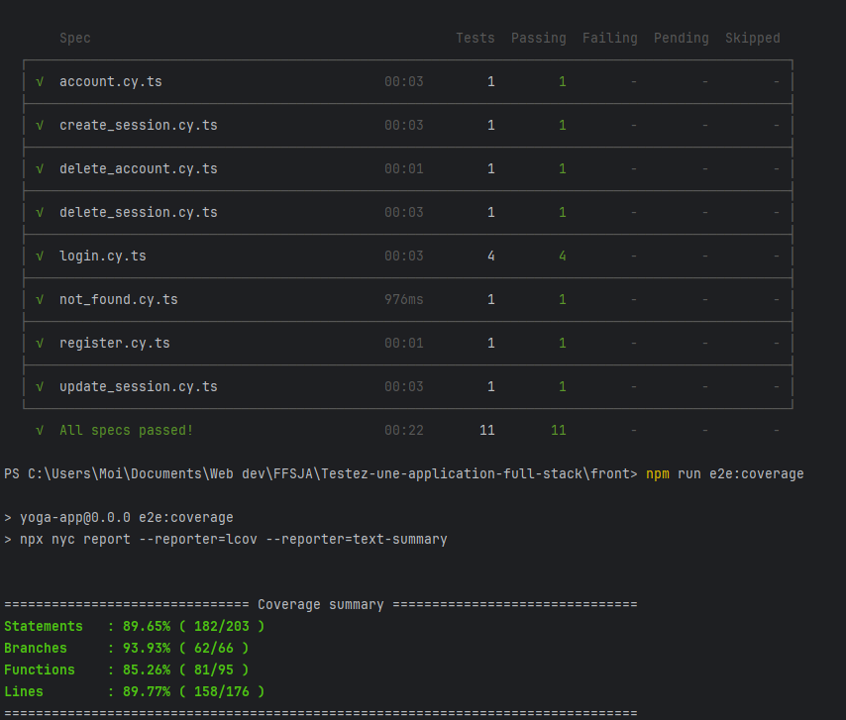
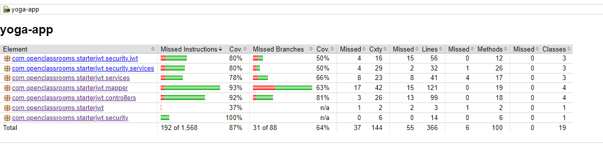

# Yoga App

Ce projet implique la finalisation du testing d'une application de réservation pour le studio de yoga Savasana, en remplacement de mon collègue Cengiz, récemment devenu papa. Ma mission a été de conduire le testing front-end, back-end, et end-to-end, en visant une couverture de test d'au moins 80%, dont 30% de tests d'intégration, en accord avec les spécifications fournies et en évitant le testing non pertinent du package DTO sur le back-end. Ce README fournit les détails pour installer, lancer l'application, et exécuter les tests, ainsi que les liens vers les rapports de couverture et le code sur GitHub.

## Démarrage Rapide

Instructions pour lancer l'application en local.

### Prérequis

- Node.js
- npm ou yarn
- Java JDK
- Maven ou Gradle

### Installation du projet en local

Cloner le repository:
```
git clone https://github.com/OpenClassrooms-Student-Center/P5-Full-Stack-testing
```

### Installation et Lancement du Backend (Spring)

```bash
cd backend
mvn spring-boot:run
```

### Installation et Lancement du Frontend (Angular)
```bash
cd frontend
npm install
ng serve
```

## Tests

### Tests Frontend

Tests unitaires avec Jest :

```bash
cd frontend
npm run test:intunit
```

Pour le frontend, les rapports de couverture Jest sont disponibles à frontend/coverage/lcov-report/index.html.



Tests d'intégration avec Cypress :
Launching e2e test:

```bash
npm run e2e
```


Generate coverage report (you should launch e2e test before):

```bash
npm run e2e:coverage
```

Pour les rapports de couverture Cypress, ouvrez frontend/cypress/coverage/lcov-report/index.html.




### Tests Backend

```bash
cd backend
mvn clean test
```

Les rapports de couverture de tests pour le backend sont générés automatiquement après l'exécution des tests unitaires et peuvent être trouvés à backend/target/site/jacoco/index.html.




